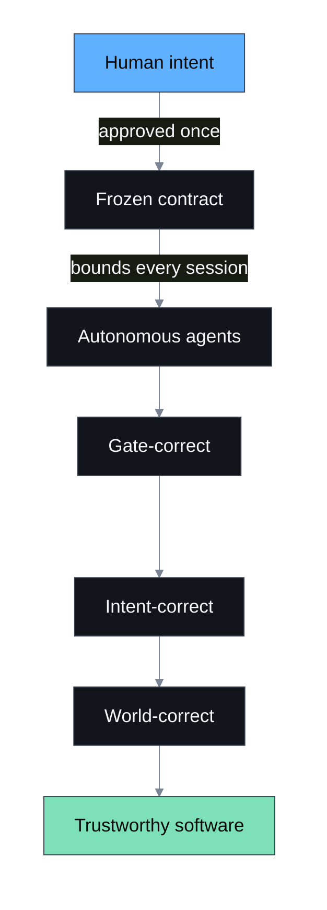

<p align="center">
  
</p>

<p align="center">
  <strong>English</strong> | <a href="README.zh-CN.md">简体中文</a>
</p>

<p align="center">
  <a href="https://github.com/JBombar/BOMBAR/actions/workflows/test.yml"></a>
  <a href="https://github.com/JBombar/BOMBAR/releases/tag/v0.1.0"></a>
  <a href="LICENSE"></a>
</p>

# BOMBAR

**B.O.M.B.A.R. — Bounded Orchestration Method for Building with Agents, Reliably.**

Coding agents will happily redesign your product while you're not looking — and "all green" doesn't mean "what you asked for." BOMBAR draws a hard line between the part only a human can do (deciding what to build) and the part an agent can do safely (building exactly that, inside a frozen contract, with evidence to prove it).

BOMBAR was distilled from more than 6,000 hours of hands-on agentic development — the patterns that consistently held were kept, the ones that quietly let scope drift were cut. What remains is a small, deterministic set of rails, not a framework you have to trust blindly.



## The boundary

```text
INTERACTIVE                              AUTONOMOUS
Owner <-> Architect                     Fresh Builder per specification
  discover intent                         implement bounded scope
  audit the terrain                       run project gates
  decide architecture                     produce evidence
  freeze acceptance                       commit and stop
  write specifications
          |                                      |
          +---------- approved digest -----------+
                                                 |
INTERACTIVE / INDEPENDENT                        v
Owner + Architect <--- verification pack <--- Verifier
```


The governing rule is simple:

> Human and Architect establish intent. Autonomous Builders execute compiled intent.

## Five-minute orientation

Requirements: Git, Bash, and Python 3.11+.

```bash
git clone https://github.com/JBombar/BOMBAR bombar
cd bombar
bash bin/bombar.sh doctor
bash bin/bombar.sh init /path/to/your-project
cd /path/to/your-project
bash .bombar/prepare-architect.sh
```

The last command prepares an initialization prompt for a **new interactive architecture session**. It does not start a headless session. Work with the Architect until the product brief, architecture, invariants, acceptance contract, plan, and specifications accurately represent the intended product.

Then:

```bash
# Validate the artifacts. This does not approve them.
bash .bombar/validate-plan.sh

# Explicit owner act: freeze their exact content.
bash .bombar/validate-plan.sh --freeze --approved-by "Your Name"

# Start fresh, bounded Builder sessions.
bash .bombar/run_bombar.sh

# Assemble a clean pack for an independent review session.
bash .bombar/prepare-verification.sh
```

Read [Getting started](docs/getting-started.md) for the complete first run.

If you are evaluating whether the method itself transferred, use the [methodology-transfer evaluation](docs/transfer-evaluation.md) instead of relying on impression.

## What BOMBAR installs

`bombar init` adds a self-contained `.bombar/` control kit and a visible `__development/bombar/` decision trail to the target repository. The kit contains:

- an interactive Architect initialization prompt;
- product, architecture, invariant, acceptance, and ADR templates;
- a machine-validated Markdown specification contract;
- a project profile containing gates and agent-adapter selection;
- approval digests that lock autonomous execution to reviewed intent;
- a resumable fresh-session-per-spec runner;
- scope, protected-path, no-op, evidence, and gate checks;
- an independent verification-pack generator.

## Greenfield and brownfield

BOMBAR classifies the **change**, not merely the repository. A new project can become brownfield as soon as real users, durable data, money, integrations, or operational reliance exist. A new isolated module inside a mature system may be greenfield-like, while connecting it to production is brownfield.

Brownfield specifications require compatibility, non-disruption, rollback, and live-canary treatment. See [Greenfield](docs/greenfield.md) and [Brownfield](docs/brownfield.md).

## Agent neutrality

The contract is provider-neutral. An adapter has one responsibility: receive a prompt-file path and start one fresh coding-agent session. BOMBAR ships example adapters and a fake adapter for its own tests. Configure the adapter explicitly; the runner never guesses credentials or silently chooses a provider.

## What BOMBAR can and cannot guarantee

BOMBAR cannot make every model equally capable, and no framework can guarantee correct software. It can make intent explicit, constrain model variance, stop unapproved redesign, expose weak or incomplete output, and distinguish:

1. **Gate-correct** — tests, checks, and build pass.
2. **Intent-correct** — the result satisfies the approved product contract.
3. **World-correct** — the intended result occurs at an external boundary.

All three matter. Green tests alone are never the final claim.

## Repository map

```text
bin/          operator entrypoint
scripts/      deterministic control machinery
templates/    artifacts installed into projects
prompts/      Architect, Planner, Builder, Verifier, and Auditor roles
schemas/      machine-readable contracts
docs/         method and adoption guides
examples/     filled greenfield and brownfield examples
tests/        hermetic fixture tests (no live agent, network, or spend)
```

## Status

This repository is the first public release of a methodology extracted from repeated real product builds. Treat `v0.1` as an executable hypothesis: use it, keep the evidence, report where the transfer succeeds or fails, and improve the rails from escaped defects.

## License

Apache License 2.0. See [LICENSE](LICENSE).
