<p align="center">
  
</p>

<p align="center">
  <strong>English</strong> | <a href="README.zh-CN.md">简体中文</a>
</p>

<p align="center">
  <a href="https://github.com/JBombar/BOMBAR/actions/workflows/test.yml"></a>
  <a href="https://github.com/JBombar/BOMBAR/releases/tag/v0.1.0"></a>
  <a href="LICENSE"></a>
</p>

# BOMBAR

**B.O.M.B.A.R. — Bounded Orchestration Method for Building with Agents, Reliably.**

## Why BOMBAR exists

Most agentic development looks like this:

1. You describe what you want.
2. The agent codes for hours.
3. Tests pass.
4. You discover it built something slightly different.
5. You spend the next day undoing "helpful" refactorings.

Every agentic developer has hit some version of the same three failures:

- **Silent redesign** — the agent "helpfully" refactors the architecture while implementing a feature.
- **Scope drift** — tests pass, but the feature does something subtly different from what was asked.
- **"All green" lies** — green checks that never actually proved the intent was satisfied.

BOMBAR replaces this with a contract:

1. **You** decide intent, architecture, and acceptance.
2. **The agent** executes exactly the approved specification.
3. **Gates** prove the result matches the contract.
4. **Evidence** records what happened, for audit.

No surprises. No silent redesign. No "all green" lies.

BOMBAR was distilled from thousands of hours of hands-on agentic development, building real products end to end — the patterns that consistently held were kept, the ones that quietly let scope drift were cut. What remains is a small, deterministic set of rails, not a framework you have to trust blindly.

<p align="center">
  
</p>

## 30-second demo

```bash
# 1. Install BOMBAR into your project
git clone https://github.com/JBombar/BOMBAR /tmp/bombar
bash /tmp/bombar/bin/bombar.sh init ./my-project
cd ./my-project

# 2. Start an interactive architecture session
bash .bombar/prepare-architect.sh
# ...talk naturally with the Architect agent...

# 3. Freeze the approved plan
bash .bombar/validate-plan.sh --freeze --approved-by "Your Name"

# 4. Run autonomous Builder sessions
bash .bombar/run_bombar.sh
# ...each slice executes, gates pass, evidence is written...

# 5. Verify independently
bash .bombar/prepare-verification.sh
```

Result: one approved spec → one evidence file → one commit → zero surprises.

## Proven in real use

BOMBAR wasn't designed on a whiteboard. It comes out of real, hands-on agentic development on real products — the specific failure modes above were lived, not hypothesized, and the rails exist because those failures were expensive enough to fix once, permanently.

See [examples/](examples/) for filled, sanitized greenfield and brownfield walkthroughs of the full lifecycle.

## The boundary

```text
INTERACTIVE                              AUTONOMOUS
Owner <-> Architect                     Fresh Builder per specification
  discover intent                         implement bounded scope
  audit the terrain                       run project gates
  decide architecture                     produce evidence
  freeze acceptance                       commit and stop
  write specifications
          |                                      |
          +---------- approved digest -----------+
                                                 |
INTERACTIVE / INDEPENDENT                        v
Owner + Architect <--- verification pack <--- Verifier
```

<p align="center">
  
</p>

The governing rule is simple:

> Human and Architect establish intent. Autonomous Builders execute compiled intent.

## Five-minute orientation

Requirements: Git, Bash, and Python 3.11+.

```bash
git clone https://github.com/JBombar/BOMBAR bombar
cd bombar
bash bin/bombar.sh doctor
bash bin/bombar.sh init /path/to/your-project
cd /path/to/your-project
bash .bombar/prepare-architect.sh
```

The last command prepares an initialization prompt for a **new interactive architecture session**. It does not start a headless session. Work with the Architect until the product brief, architecture, invariants, acceptance contract, plan, and specifications accurately represent the intended product.

Then:

```bash
# Validate the artifacts. This does not approve them.
bash .bombar/validate-plan.sh

# Explicit owner act: freeze their exact content.
bash .bombar/validate-plan.sh --freeze --approved-by "Your Name"

# Start fresh, bounded Builder sessions.
bash .bombar/run_bombar.sh

# Assemble a clean pack for an independent review session.
bash .bombar/prepare-verification.sh
```

Read [Getting started](docs/getting-started.md) for the complete first run.

If you are evaluating whether the method itself transferred, use the [methodology-transfer evaluation](docs/transfer-evaluation.md) instead of relying on impression.

## Who BOMBAR is for

- Teams shipping complex features where scope drift costs real money.
- Solo developers who need to delegate overnight and sleep soundly.
- Projects with audit, compliance, or safety requirements.
- Brownfield systems where "just refactor everything" is not an option.
- Anyone who has watched an agent silently redesign their auth layer.

## Who BOMBAR is not for

- Quick prototypes where "good enough" is the bar.
- Teams who want the agent to "figure it out" without specifications.
- Projects with no test infrastructure — gates need something to gate against.
- Developers who enjoy debugging surprise refactorings at 3am.

## What BOMBAR installs

`bombar init` adds a self-contained `.bombar/` control kit and a visible `__development/bombar/` decision trail to the target repository. The kit contains:

- an interactive Architect initialization prompt;
- product, architecture, invariant, acceptance, and ADR templates;
- a machine-validated Markdown specification contract;
- a project profile containing gates and agent-adapter selection;
- approval digests that lock autonomous execution to reviewed intent;
- a resumable fresh-session-per-spec runner;
- scope, protected-path, no-op, evidence, and gate checks;
- an independent verification-pack generator.

## Greenfield and brownfield

BOMBAR classifies the **change**, not merely the repository. A new project can become brownfield as soon as real users, durable data, money, integrations, or operational reliance exist. A new isolated module inside a mature system may be greenfield-like, while connecting it to production is brownfield.

Brownfield specifications require compatibility, non-disruption, rollback, and live-canary treatment. See [Greenfield](docs/greenfield.md) and [Brownfield](docs/brownfield.md).

## Agent neutrality

The contract is provider-neutral. An adapter has one responsibility: receive a prompt-file path and start one fresh coding-agent session. BOMBAR ships example adapters and a fake adapter for its own tests. Configure the adapter explicitly; the runner never guesses credentials or silently chooses a provider.

## What BOMBAR guarantees

- ✅ **No silent redesign** — agents execute approved specs, nothing else.
- ✅ **Deterministic gates** — green means "verified against contract," not "probably fine."
- ✅ **Evidence for every slice** — what changed, why, and how it's proven.
- ✅ **Scope enforcement** — protected paths cannot be touched without owner approval.
- ✅ **Fresh isolation** — one session per slice, no conversational state bleeding.

## What requires your judgment

- 🎯 **Product intent** — you decide what to build.
- 🎯 **Architecture** — you choose the design.
- 🎯 **Live acceptance** — you verify real-world behavior.
- 🎯 **Model capability** — BOMBAR cannot make a weak model strong.

Gate-correct, intent-correct, and world-correct are three different claims. All three matter. Green tests alone are never the final one.

## Repository map

```text
bin/          operator entrypoint
scripts/      deterministic control machinery
templates/    artifacts installed into projects
prompts/      Architect, Planner, Builder, Verifier, and Auditor roles
schemas/      machine-readable contracts
docs/         method and adoption guides
examples/     filled greenfield and brownfield examples
tests/        hermetic fixture tests (no live agent, network, or spend)
```

## Status

BOMBAR is `v0.1` — the first public release of a method proven through real, hands-on agentic development, not designed in the abstract.

The core patterns are stable. The framework will evolve as more projects test it. Every escaped defect strengthens the rails.

Use it. Keep the evidence. Report where the transfer succeeds or fails.

## License

Apache License 2.0. See [LICENSE](LICENSE).
